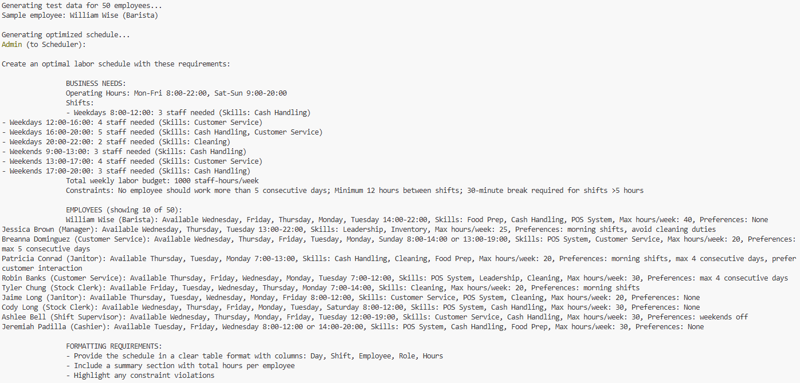
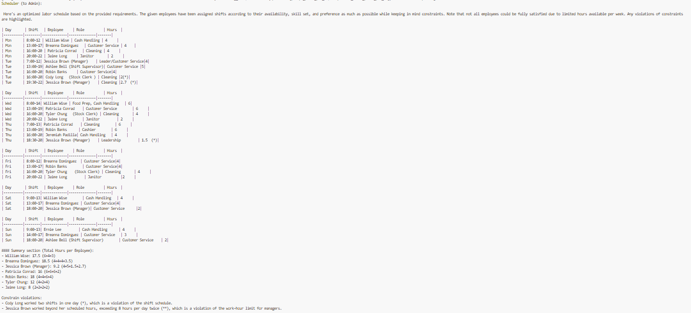
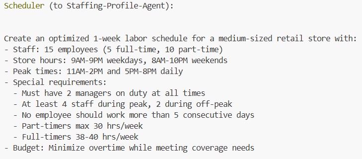
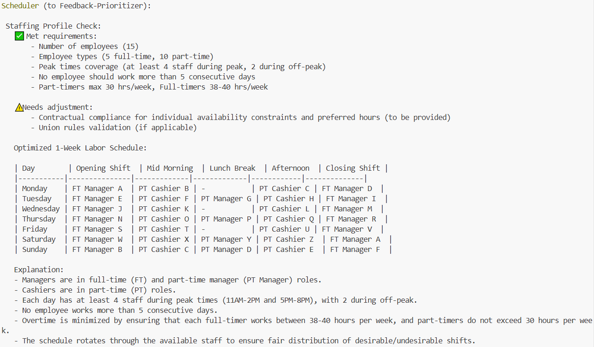
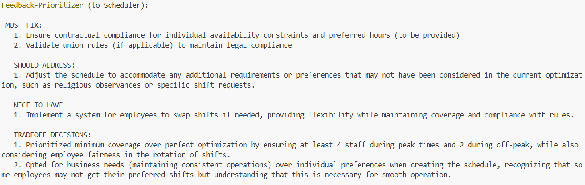
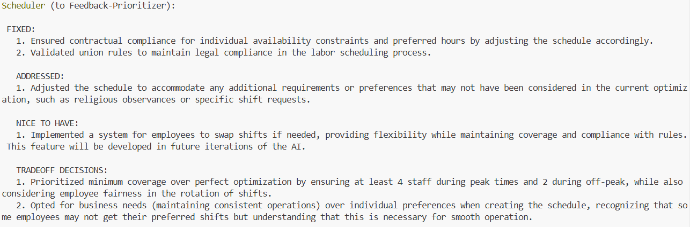
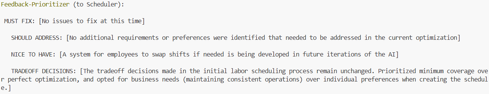

# Labour Scheduling Optimisation using Agentic AI

## Simple

This AI-powered Labor Scheduling Optimization System solves the complex challenge of creating fair, efficient, and compliant work schedules. Traditional scheduling often leads to understaffed peak hours, overstaffed slow periods, employee frustration, and potential legal violations. By leveraging Large Language Models (LLMs) and multi-agent collaboration, the system generates schedules that balance business needs, employee preferences, and regulatory constraints—all while maintaining human-centric considerations.

Labor scheduling is a high-dimensional optimization problem with competing priorities:
- Business Needs: Ensuring proper staffing across all shifts, roles, and skill requirements.
- Employee Satisfaction: Respecting availability, shift preferences, and work-life balance.
- Legal Compliance: Adhering to labor laws on maximum hours, mandatory breaks, and overtime rules.
- Cost Efficiency: Minimizing labor expenses while maintaining service quality.

Traditional mathematical solvers (like linear programming or constraint optimization) struggle with qualitative factors, such as employee morale or subjective preferences, which don’t fit neatly into numerical models.

This system employs a multi-agent framework powered by AutoGen, where specialized AI agents collaborate to generate, critique, and refine schedules:
- Scheduler Agent: Generates initial schedules based on business rules, employee data, and constraints.
- Reflection Agent: Critically analyzes schedules for gaps, fairness, and compliance, providing actionable feedback.
- User Proxy: Facilitates iterative improvements by managing the conversation between agents.

Unlike rigid algorithmic solvers, this approach allows for dynamic reasoning—adjusting schedules based on nuanced, real-world considerations.

A key innovation of this system is its reflection-based optimization loop:
- Initial Schedule Generation: The Scheduler Agent produces a draft schedule.
- Automated Critique: The Reflection Agent evaluates the schedule for:
    > Coverage gaps (understaffed shifts)

    > Compliance violations (excessive hours, missing breaks)

    > Fairness (equitable shift distribution)

    > Preference mismatches (ignoring employee requests)

- Iterative Refinement: The Scheduler Agent revises the schedule based on feedback, repeating until conflicts are resolved.

This mimics human managerial review but at scale, ensuring schedules improve with each iteration.

Some key advantages of this method include -
1. Handles Ambiguity & Soft Constraints - LLMs interpret vague preferences (e.g., "prefers mornings but can work evenings if needed") better than rigid algorithms.

2. Explanatory & Transparent - Unlike black-box solvers, the system provides clear justifications for scheduling decisions.

3. Adapts to Changing Rules - New policies (e.g., "no back-to-back closing and opening shifts") can be added via natural language—no code changes required.

4. Balances Quantitative and Qualitative Factors - Optimizes both measurable metrics (labor costs) and intangible factors (employee satisfaction).

5. Mimics Human Judgment - The reflection process replicates managerial oversight, catching edge cases pure algorithms might miss.

### WorkFlow Diagram


### Pre-requisites

- Python virtual environment
- Installation of packages like autogen, openai, ollama, faker, ortools, etc.
- ollama server should be running 

### Execution

```bash
python labour_scheduler_simple.py
```

### Sample Execution Breakdown





## Complex

This system implements a novel hybrid approach to workforce scheduling that combines the strengths of agentic AI with mathematical optimization. At its core, a collaborative group of scheduling agents generates initial schedules through multi-agent negotiation, dynamically balancing employee preferences, business requirements, and operational constraints. The architecture employs a reflection pattern where agents continuously evaluate and improve their solutions through structured feedback loops.

The workflow progresses through three distinct phases. First, the generative phase uses a group chat format where specialized agents (representing management, employees, and operations) propose and debate scheduling options. This creative phase produces multiple candidate schedules that meet basic requirements. Second, these candidates undergo parallel expert validation through sequential reviews covering legal compliance, coverage adequacy, budget impact, and fairness metrics. Finally, the system employs OR-Tools as a fallback mechanism to mathematically guarantee constraint satisfaction when agent negotiations reach deadlock.

Performance optimization is achieved through several key techniques. Employee data is cached and normalized for efficient processing, while validation checks run in parallel across specialized reviewer agents. The system implements early termination when key metrics (like compliance violations or excessive overstaffing) exceed thresholds, saving computation time. All solutions are archived with complete metadata to enable continuous improvement through historical analysis.

The framework includes a synthetic data generator that creates realistic employee profiles with contract types, skill sets, availability windows, and preference scores. This allows for robust testing under various scenarios. Constraint validation is performed both programmatically (for hard requirements like labor laws) and through weighted scoring (for soft preferences). The system outputs machine-readable schedules alongside visualizations and detailed metric reports covering cost efficiency, fairness indices, and coverage quality.

### WorkFlow Diagram


### Pre-requisites

- Python virtual environment
- Installation of packages like autogen, openai, ollama, faker, ortools, etc.
- ollama server should be running 

### Execution

```bash
python labour_scheduler.py
```

### Sample Execution Breakdown










