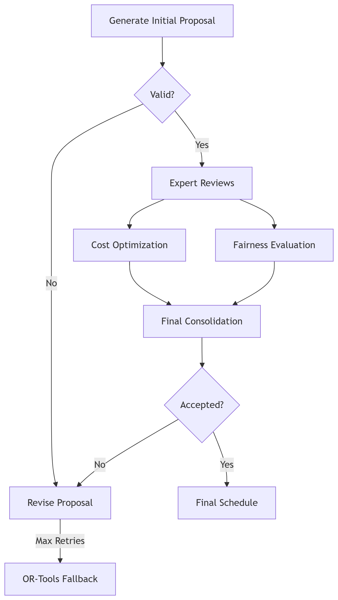

# Labour Scheduling Optimisation using Agentic AI

A very simple hybrid approach following Reflection Framework of Agentic AI is explained here that combines the best of group chat and sequential workflows for a labour scheduling problem with some key constraint considerations. In this hybrid architecture, group chat is used for collaborative problem-solving, sequential expert reviews is used for specialized validation and OR-Tools is used as a fallback mechanism for guaranteed solutions. For the data demonstration perspective, synthetic employee data is generated. Constraint validation is performed programatically with metrics such as cost and fairness. The performance optimisation is obtained by caching the employee data, performing parallel expert reviews and some basic early termination checks.

